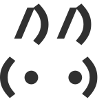

[](https://www.npmjs.com/package/@alexgorbatchev/agentation)
[](https://www.npmjs.com/package/@alexgorbatchev/agentation)

**[Agentation](https://agentation.dev)** is an agent-agnostic visual feedback tool. Click elements on your page, add notes, and copy structured output that helps AI coding agents find the exact code you're referring to.

This repository started as a fork of [benjitaylor/agentation](https://github.com/benjitaylor/agentation) and is now maintained as the canonical home of `@alexgorbatchev/agentation`.

## Install

Install both the frontend package and the CLI companion:

```bash
npm install @alexgorbatchev/agentation -D
npm install -g @alexgorbatchev/agentation-cli
```

If you prefer, you can install the CLI from source or another package manager via [`@alexgorbatchev/agentation-cli`](https://github.com/alexgorbatchev/agentation-cli).

## Usage

Start the local Agentation stack first:

```bash
agentation start
```

Then add the component to your app:

```tsx
import { Agentation } from '@alexgorbatchev/agentation';

function App() {
  return (
    <>
      <YourApp />
      <Agentation projectId="my-project" />
    </>
  );
}
```

For the full synced workflow, run the local Agentation server first. By default, the toolbar probes `http://127.0.0.1:4747` on load and connects to the running local CLI/server automatically. If no local server is discovered, Agentation falls back to local-only copy/paste mode.

The toolbar appears in the bottom-right corner. Click to activate, then click any element to annotate it.

`<Agentation />` renders wherever you mount it. If you only want it in development, gate it in your application:

```tsx
function App() {
  const shouldRenderAgentation = process.env.NODE_ENV !== 'production';

  return (
    <>
      <YourApp />
      {shouldRenderAgentation ? <Agentation projectId="my-project" /> : null}
    </>
  );
}
```

## Features

- **Click to annotate** – Click any element with automatic selector identification
- **Text selection** – Select text to annotate specific content
- **Multi-select** – Drag to select multiple elements at once
- **Area selection** – Drag to annotate any region, even empty space
- **Animation pause** – Freeze all animations (CSS, JS, videos) to capture specific states
- **Structured output** – Copy markdown with selectors, positions, and context
- **Dark/light mode** – Matches your preference or set manually
- **Zero dependencies** – Pure CSS animations, no runtime libraries

## How it works

Agentation captures class names, selectors, and element positions so AI agents can `grep` for the exact code you're referring to. Instead of describing "the blue button in the sidebar," you give the agent `.sidebar > button.primary` and your feedback.

## Requirements

- React 18+
- Desktop browser (mobile not supported)

## Docs

- [agentation.dev](https://agentation.dev) — public docs and examples
- [@alexgorbatchev/agentation-cli](https://github.com/alexgorbatchev/agentation-cli) — local server/router CLI
- [@alexgorbatchev/agentation.nvim](https://github.com/alexgorbatchev/agentation.nvim) — Neovim bridge plugin ([npm](https://www.npmjs.com/package/@alexgorbatchev/agentation.nvim))
- [@alexgorbatchev/agentation-skills](https://github.com/alexgorbatchev/agentation-skills) — shared coding-agent skills
- [@alexgorbatchev/pi-agentation](https://github.com/alexgorbatchev/pi-agentation) — Pi integration package

## How the pieces fit together

Agentation is designed as an ecosystem rather than a single package:

1. **`@alexgorbatchev/agentation`** lives in your app and gives reviewers an in-page annotation toolbar.
2. **[`@alexgorbatchev/agentation-cli`](https://github.com/alexgorbatchev/agentation-cli)** provides the required local server/router layer for real-time sync, project discovery, pending queues, watch flows, and editor routing.
3. **[`@alexgorbatchev/agentation.nvim`](https://github.com/alexgorbatchev/agentation.nvim)** is the optional Neovim bridge that lets component-source links opened from the browser jump directly into your active Neovim session.
4. **[`@alexgorbatchev/agentation-skills`](https://github.com/alexgorbatchev/agentation-skills)** packages the shared fix-loop skill used by coding agents to consume pending annotations from the CLI.
5. **[`@alexgorbatchev/pi-agentation`](https://github.com/alexgorbatchev/pi-agentation)** wires Pi into that loop so it can repeatedly pick up Agentation work for a project.

In practice, the flow looks like this:

- install `@alexgorbatchev/agentation` in your frontend
- install and run `@alexgorbatchev/agentation-cli`
- annotate UI directly in the browser against the running local stack
- optionally connect Neovim for source navigation
- optionally run Pi + Agentation skills to turn pending annotations into an automated fix loop

## What’s different in this repository

Compared with the original upstream project, this repository includes:

- **Annotation thread + reply UI** for richer async feedback loops
- **Deep select** to pierce overlays and target nested or covered elements
- **Alt hold-to-select mode** with a crosshair cursor for precision targeting
- **Review queue for resolved annotations** to manage follow-up workflows
- **Endpoint auto-probe on load**: if `endpoint` is omitted, the toolbar probes `http://127.0.0.1:4747` once and uses local sync only when reachable
- **Configurable source navigation side effects** via `navigateToUrl` for component source links
- **Unsafe source-probing hardening** with an explicit allowlist requirement
- **Storybook + expanded automated test coverage**
- **Neovim integration** via [`@alexgorbatchev/agentation.nvim`](https://github.com/alexgorbatchev/agentation.nvim)

## Repository structure

- `packages/agentation/` — publishable npm package
- `packages/example/` — website/docs app

## Development

```bash
pnpm install
pnpm build
pnpm test
```

Coverage workflow:

```bash
# Stable package coverage run (unit project)
pnpm --filter @alexgorbatchev/agentation exec vitest run --coverage

# Explicit unit-only coverage
pnpm --filter @alexgorbatchev/agentation exec vitest run --project unit --coverage
```

Notes:

- `pnpm test` remains the full suite entry point (including browser/storybook tests).
- Coverage runs are aligned to the supported Vitest coverage path above.

## License

Original work © 2026 Benji Taylor. Current fork maintained by Alex Gorbatchev.

Licensed under PolyForm Shield 1.0.0
